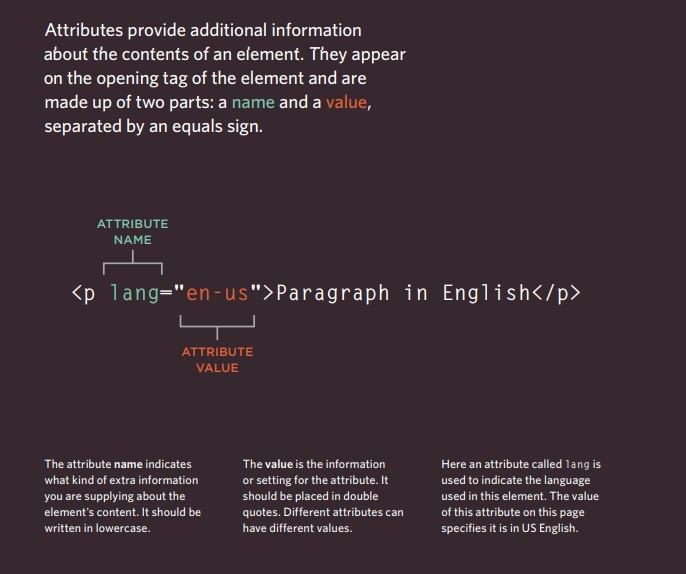
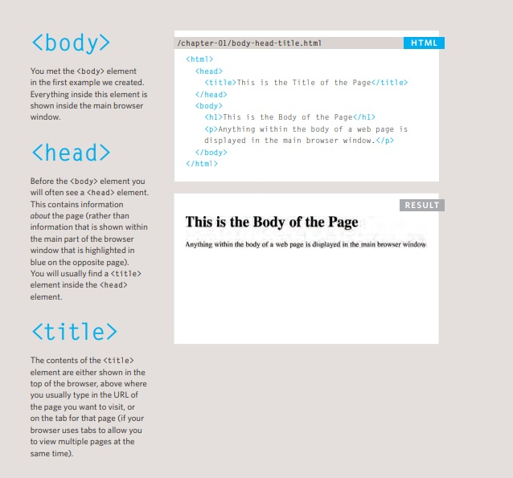
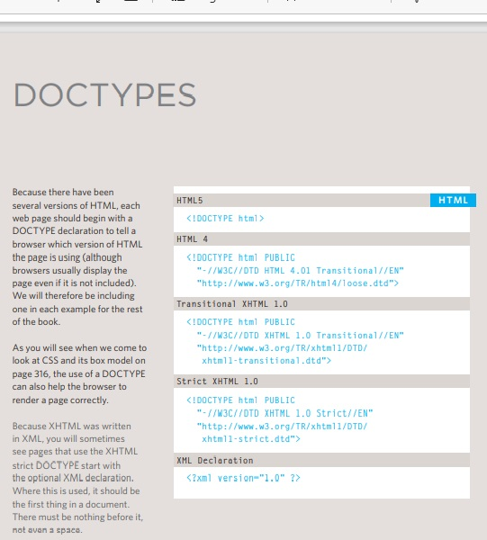
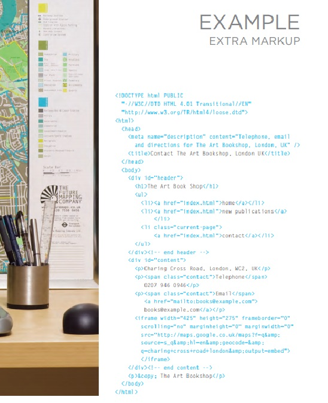
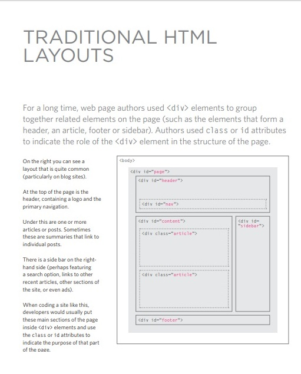
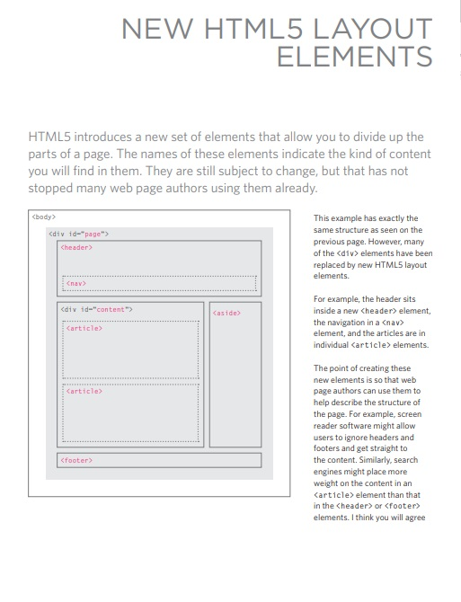
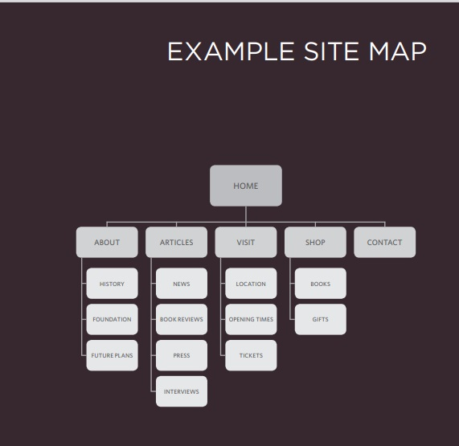
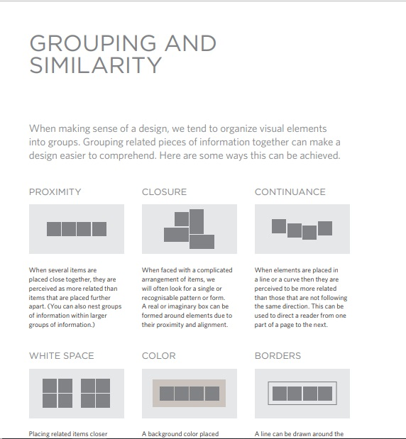
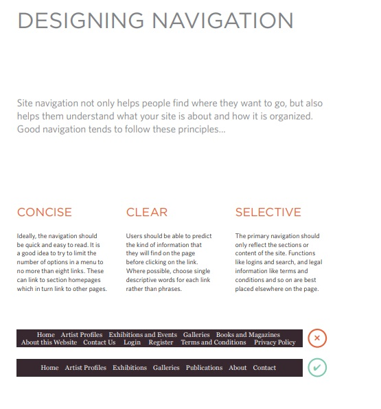
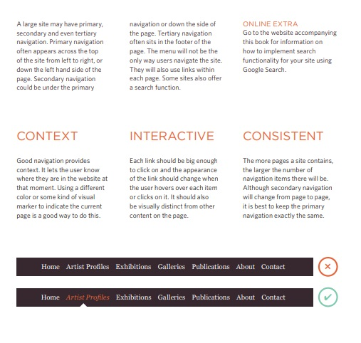

# Definitions  

## Browsers

### view a web page, users might type a web address into their browser, follow a link from another site, or use a bookmark.

### examples firefox,mozila
***

## Web Servers

### are special computers that are constantly connected to the Internet, and are optimized to send web pages out to people who request them
***

## Screen readers

### Screen readers are programs that read out the contents of a computer screen to a user.
###  They are commonly used by people with visual impairments .

***
## Devices

### including desktop computers,
### laptops, tablets, and mobile phones.
***
***
***

# How Websites Are Created

### Small websites are often written just using HTML and CSS.

### Larger websites — in particular those that are updated regularly and use a content management system (CMS0), blogging tools, or e-commerce software — often make use of more complex technologies on the web server,

 

### but these technologies are actually used to produce HTML and CSS that is then sent to the browser. So, if your site uses these technologies, you will be able to use your new HTML and CSS knowledge to take more control over how your site looks

 

### Larger, more complex sites like these may use a database to store data, and programming languages such as PHP, ASP. Net, Java, or Ruby on the web server, but you do not need to know these technologies to improve what the user sees. The skills you'll learn in this book should be enough to help you on that road.

******
********

# HTML Describes the Structure of Pages

### To describe the structure of a web page, we add code to the words we want
### to appear on the page.You can see the HTML code for this page below. Don't worry about what
### the code means yet. We start to look at it in more detail on the next  page. Note that the HTML code is in blue, and the text you see on screen is in black.

 

>< html>
< body>
 < h1>This is the Main Heading</ h1>
   
 < p>This text might be an introduction to the rest of
 the page. And if the page is a long one it might
 be split up into several sub-headings.< p>
  < h2>This is a Sub-Heading</ h2 >
  < p >Many long articles have sub-headings so to help
 you follow the structure of what is being written.
 There may even be sub-sub-headings (or lower-level
 headings).< /p>
  < h2 >Another Sub-Heading</ h2 >
  < p >Here you can see another sub-heading.</ p >
 </ body >
 </ html >' 

---
---
---

# What is Attributes
## Attributes Tell Us More About Elements

 

 

---
---

# Body, Head & Title
##

----
----

# Summary
   
 FORMS
  

## X Whenever you want to collect information from visitors you will need a form, which lives inside a
## < form> element.
  

## X Information from a form is sent in name/value pairs.
 

##  X Each form control is given a name, and the text the user types in or the values of the options they select are sent to the server.
  

##  X HTML5 introduces new form elements which make it easier for visitors to fill in forms.

--------------
-------------
--------------

# DOCTYPES

 

# Extra Markup

 

 
----
----

# Layout 

 

 

# Who is the Site For?

## Target Audience: individuals

### ● What is the age range of your target audience?
● Will your site appeal to more women or men? What is the mix?
● Which country do your visitors live in?
● Do they live in urban or rural areas?
● What is the average income of visitors?
● What level of education do they have?
● What is their marital or family status?
● What is their occupation?
● How many hours do they work per week?
● How often do they use the web?
● What kind of device do they use to access the web?

 

## Target Audience: Companies
● What is the size of the company or relevant department?
● What is the position of people in the company who visit your site?
● Will visitors be using the site for themselves or for someone else?
● How large is the budget they control?

 

<bt>

 

 

# Site Map 

# Grouping

 

# Navigation

### X It's important to understand who your target audience
is, why they would come to your site, what information
they want to find and when they are likely to return.
 
X Site maps allow you to plan the structure of a site.
 
X Wireframes allow you to organize the information that
will need to go on each page.
 
X Design is about communication. Visual hierarchy helps
visitors understand what you are trying to tell them.
 
X You can differentiate between pieces of information
using size, color, and style.
 
X You can use grouping and similarity to help simplify
the information you present.

JavaScript Functions
Ssmmarize
What is Function ?
A method or a proccess that we call or request many timesfor
do some thing like summation , subtraction etc .

Standard Naming Of Function
standard naming of function is calles camel case that evry word in the name of function should or prefear to begin with capital case latter .
like sumOfNums(){......} like getValueOf {.......}

Function Example

This Function returns the result of summation between two variables

''' function summation(num1,num2)
{ var sum = num1 + num2 ;
return sum;
} '''

Invoking Functions
functions can be invoked in javascript block of code or in any element by some event .

Ex To Invoke the previous function in script

'< script >

document.write(summation(1,2));

< /script > '