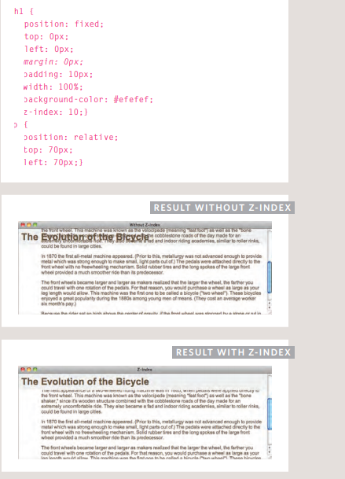

# HTML Links, JS Functions, and Intro to CSS Layout

# What Is Link

## Links are created using the < a> element. Users can click on anything  between the opening < a> tag and the closing < /a> tag. You specify which page you want to link to using the href attribute.

>< a href=" http ://www.imdb.com">IMDB< /a>

## Linking to Other Sites

>< p>Movie Reviews:
< ul>
 < li>< a href="http://www.empireonline.com">
 Empire< /a>< /li>
 < li>< a href=" http ://www.metacritic.com">
 Metacritic< /a>< /li>
 < li>< a href=" http ://www.rottentomatoes.com">
 Rotten Tomatoes< /a>< /li>
 < li>< a href="http://www.variety.com">
 Variety< /a>< /li>
< /ul>
</ p>

# Linking to Other Pages on the Same Site

>< p>
< ul>
 < li>< a href="index.html">Home< /a>< /li>
 < li>< a href="about-us.html">About< /a>< /li>
 < li>< a href="movies.html">Movies< /a>< /li>
 < li>< a href="contact.html">Contact< /a>< /li>
< /ul>
< /p>

# Directory Structure
## Structure
    The diagram on the right shows
the directory structure for a
fictional entertainment listings
website called ExampleArts.

The top-level folder is known
as the root folder. (In this
example, the root folder is called
examplearts.) The root folder
contains all of the other files and
folders for a website.

Each section of the site is placed
in a separate folder; this helps
organize the files.

## Relationships
    The relationship between
files and folders on a website
is described using the same
terminology as a family tree.

In the diagram on the right, you
can see some relationships have
been drawn in.

The examplearts folder is a
parent of the movies, music
and theater folders. And the
the movies, music and theater
folders are children of the
examplearts folder

## Homepages
    The main homepage of a site
written in HTML (and the
homepages of each section in a
child folder) is called index.html.

Web servers are usually set up
to return the index.html file if no
file name is specified.

Therefore, if you enter
examplearts. com it will return
examplearts .com/index
.html, and examplearts. com/
music will return examplearts
.com/music/index.html.

# Relative URLs

## Relative URLs can be used when linking to pages within your ownwebsite. They provide a shorthand way of telling the browser where tofind your files.

# Email Links

## mailto:
To create a link that starts up
the user's email program and
addresses an email to a specified
email address, you use the < a>
element. However, this time the
value of the href attribute starts
with mailto: and is followed by
the email address you want the
email to be sent to.

< a href="mailto:jon@example.org">Email Jon< /a>

# Opening Links in a New Window

## target
If you want a link to open in a
new window, you can use the
target attribute on the opening
< a> tag. The value of this
attribute should be _blank.
One of the most common
reasons a web page author
might want a link to be opened
in a new window is if it points to
another website. In such cases,
they hope the user will return
to the window containing their
site after finishing looking at the
other one.
Generally you should avoid
opening links in a new window,
but if you do, it is considered
good practice to inform users
that the link will open a new
window before they click on

> < a href="http: //www. imdb. com" target="_blank">
Internet Movie Database< /a> (opens in new window)

---
---
---
# LAYOUT 

## Controlling the Position of Elements

## Normal flow
Every block-level element
appears on a new line, causing
each item to appear lower down
the page than the previous one.
Even if you specify the width
of the boxes and there is space
for two elements to sit side-byside, they will not appear next
to each other. This is the default
behavior (unless you tell the
browser to do something else).

## Relative Positioning
This moves an element from the
position it would be in normal
flow, shifting it to the top, right,
bottom, or left of where it
would have been placed. This
does not affect the position of
surrounding elements; they stay
in the position they would be in
in normal flow.

## Absolute positioning
This positions the element
in relation to its containing
element. It is taken out of
normal flow, meaning that it
does not affect the position
of any surrounding elements
(as they simply ignore the
space it would have taken up).
Absolutely positioned elements
move as users scroll up and
down the page.

## Fixed Positioning
This is a form of absolute
positioning that positions
the element in relation to the
browser window, as opposed
to the containing element.
Elements with fixed positioning
do not affect the position of
surrounding elements and they
do not move when the user
scrolls up or down the page.

## Floating Elements
Floating an element allows
you to take that element out
of normal flow and position
it to the far left or right of a
containing box. The floated
element becomes a block-level
element around which other
content can flow

## OverLapping Elements

z-index 

## Clearing Floats

## Clear

The clear property allows you
to say that no element (within
the same containing element)
should touch the left or righthand sides of a box. It can take
the following values:

## left
The left-hand side of the box
should not touch any other
elements appearing in the same
containing element.

## right
The right-hand side of the
box will not touch elements
appearing in the same containing
element.

## both
Neither the left nor right-hand
sides of the box will touch
elements appearing in the same
containing element.

## none
Elements can touch either side.
In this example, the fourth
paragraph has a class called
clear. The CSS rule for this
class uses the clear property
to indicate that nothing should
touch the left-hand side of it. The
fourth paragraph is therefore
moved further down the page
so no other element touches its
left-hand side.
Clearing Floats
