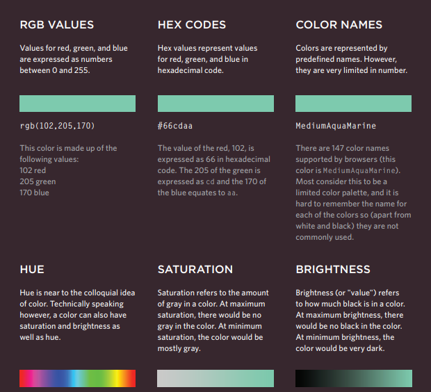

# IMAGES IN HTML

## Adding Images

> ### < img src="images/quokka.jpg" alt="A family of quokka"   title="The quokka is an Australian  marsupial that is similar in size to the  domestic cat." />

## src
This tells the browser where
it can find the image file. This
will usually be a relative URL
pointing to an image on your
own site. (Here you can see that
the images are in a child folder
called images — relative URLs
were covered on pages 83-84)

## alt
This provides a text description
of the image which describes the
image if you cannot see it.

## title
You can also use the title
attribute with the < img> element
to provide additional information
about the image. Most browsers
will display the content of this
attribute in a tootip when the
user hovers over the image.
---
---
---

## Height & Width of Images 
> < img src="images/quokka.jpg"   alt="A family of
 quokka" width="600" height="450" />

 ## height
This specifies the height of the
image in pixels.

## width
This specifies the width of the
image in pixels.
Images often take longer to
load than the HTML code that
makes up the rest of the page.
It is, therefore, a good idea to
specify the size of the image
so that the browser can render
the rest of the text on the page
while leaving the right amount of
space for the image that is still
loading.

---
---
##  Aligning Images Horizontally

## align 
The align attribute was
commonly used to indicate how
the other parts of a page should
flow around an image. It has
been removed from HTML5
and new websites should use
CSS to control the alignment of
images

## eft
This aligns the image to the left
(allowing text to flow around its
right-hand side).

---
---

## right
This aligns the image to the right
(allowing text to flow around its
left-hand side).

## Aligning Images Vertically

## top
This aligns the first line of the
surrounding text with the top of
the image.

>< img src= ".." align="top">

## middle
This aligns the first line of the
surrounding text with the middle
of the image.

>< img src= ".." align="center">

## bottom
This aligns the first line of the
surrounding text with the bottom
of the image
>< img src= ".." align="bottom">

***
***
***
# Colors In HTML

## Types of colors in Html And CSS 

## rgb values
These express colors in terms
of how much red, green and
blue are used to make it up. For
example: rgb(100,100,90)
 
 >p {
color: rgb(100,100,90);}

 ## hex codes

These are six-digit codes that
represent the amount of red,
green and blue in a color,
preceded by a pound or hash #
sign. For example: #ee3e80
> h2 {
color: #ee3e80;}

## color names
There are 147 predefined color
names that are recognized
by browsers. For example:
DarkCyan

> h1 {
color: DarkCyan;}

***

## background-color

 > body {
background-color: rgb(200,200,200);}

>h1 {
background-color: DarkCyan;}

>h2 {
background-color: #ee3e80;}

>p {
background-color: white;}

***
***

## font-family

### allows you to specify the typeface that should be used for any text inside the element(s) to which a CSS rule applies.

> body {
 font-family: Georgia, Times, serif;}

 >font-size
### The font-size property enables you to specify a size for the font. There are several ways to specify the size of a font. The most common are:
* ### pixels
* ### percentages
* ### ems

## @font-face
### @font-face allows you to use a font, even if it is not installed on the computer of the person browsing, by allowing you to specify a path to a copy of the font, which will be downloaded if it is not on the user's machine.
 
 

>@font-face {
font-family: 'ChunkFiveRegular';
src: url('fonts/chunkfive.eot');} 
h1, h2 {
font-family: ChunkFiveRegular, Georgia, serif;}

## Bold
## font-weight

* normal
* bold

## font-style

* oblique
* italic
* normal

## text-transform
* uppercase
* lowercase
* capitalize

## Underline & Strike
### text-decoration 
### none
This removes any decoration
already applied to the text.
## underline
This adds a line underneath the
text.
## overline
This adds a line over the top of
the text.
## line-through
This adds a line through words.
## blink
This animates the text to make it
flash on and off (however this is
generally frowned upon, as it is
considered rather annoying).

## Leading

## line-height
Leading (pronounced ledding) is
a term typographers use for the
vertical space between lines of
text. In a typeface, the part of
a letter that drops beneath the
baseline is called a descender,
while the highest point of a letter
is called the ascender. Leading
is measured from the bottom of
the descender on one line to the
top of the ascender on the next

## Letter & Word Spacing

> h1, h2 {
text-transform: uppercase;
letter-spacing: 0.2em;}  
.credits {
font-weight: bold;
word-spacing: 1em;}

## Alignment
# text-align
* left 
* right
* center

## text-shadow
> text-shadow: 1px 1px 0px #000000;}

## Styling Links 
## :link, :visited

## :link
This allows you to set styles
for links that have not yet been
visited. 

## :visited
This allows you to set styles for
links that have been clicked on. 

