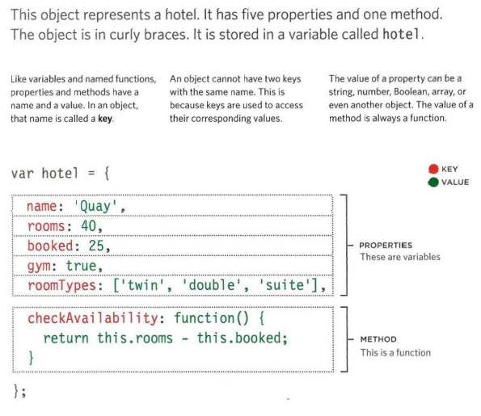
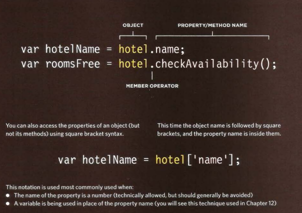
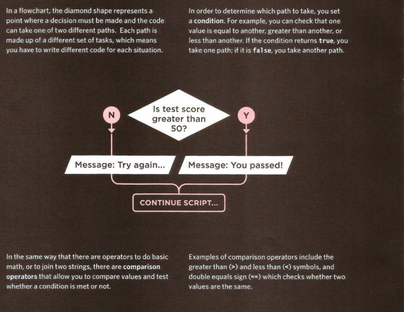
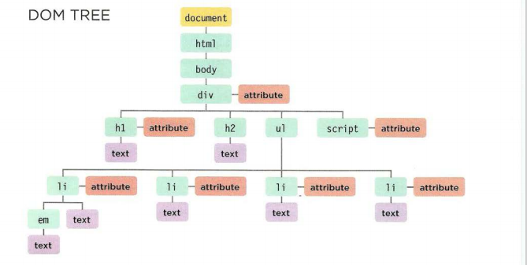

# Objects

## oup together a set of variables and functions to create a model of a something you would recognize from the real world. In an object, variables and functions take on new names. 

 
 
 

 
 

 
 
 

 # Creating Object 

 
 
 

 
 
 

 # Accissing Object

 
 
 
____________________________________________

# CREATING· OBJECTS USING LITERAL NOTATION 
____________________________________________

' var hote l = {

name: 'Quay',

rooms: 40,

booked : 25,

checkAvailability: function() {

return this.rooms - this.booked;

}
} ;

var el Name = document .getElementByld('hotelName');

elName.textContent =hotel .name;

var elRooms = document.getElementByid{'rooms');

elRooms.textContent = hotel .checkAvailability();'

# CREATING MORE OBJECT LITERALS
' var hotel = {
name: 'Park',
rooms: 120,
booked : 77,
c03/js/ object-l iteral2.js
checkAvailabi lity: function() {
return this.rooms - this.booked;
}
} ;
var elName = document .getElementByid('hotelName') ;
elName .textContent =hotel .name ;
var el Rooms = document .getElementByid( 'rooms') ;
e 1 Rooms . text Content = hote 1 . checkAvai l abi lity(); 
 ' 

 # CREATING A DATE OBJECT 

 > CD var t oday = new Date();  
 (3) var year = today .getFullYear();  
  var el = document .getElementByld('foot er' );  
  el .innerHTML = '
Copyright &copy;' +year+ '
'; 

   
     

   # WORKING WITH DATES & TIMES 

  > var today= new Date(); 
  var year= today.getFullYear(); 
    var est= new Oate('Apr 16, 1996 15:45:55 '); 
  11) var difference= today.getTime() - est.getTime();   Q) difference= (difference/ 31556900000);  
var elMsg = document.getElementByid('message'); 
  elMsg.textContent = Math.floor(difference) + ' years of online travel advice'; 

    
___________________________

# Decisions  and Loop

___________________________

  

     
_____________________________________________

# Document Object Model (DOM)

## The Document Object Model (DOM) specifies how browsers should create a model of an HTML page and how JavaScript can access and update the contents of a web page while it is in the browser window. 

## MAKING A MODEL OF THE
HTM L PAGE
When the browser loads a web page, it
creates a model of the page in memory.

## ACCESSING AND CHANGING  HTML PAGE
The DOM also defines methods and
properties to access and update each
object in this model, which in turn updates
what the user sees in the browser. 

## The DOM specifies the way in which the
browser should structure this model using
' a DOM tree '

## Application Programming Interface (API).
User interfaces let humans interact with
programs; APls let programs (and scripts)
talk to each other. The DOM states what
your script can "ask the browser about the
current page, and how to tell the browser
to update what is being shown to the user.

_____________________________
_____________________________
______________________________
   
## THE DOM TREE IS A MODEL OF A WEB PAGE

<pre> BODY OF HTML PAGE 
< html> 
 < body> 
  < di v id="page"> 
  < hl id="header">List< /hl> 
  < h2>Buy groceries< /h2> 
    < ul > 
      < li id="one" class="hot">< em>fresh< /em> figs< /li> 
      < li id="two" class="hot">pine nuts</ l i> 
      < l i id="three" class="hot">honey</ l i > 
      < l i id="four">balsamic vinegar</ l i> 
    </ ul > 
  < script src="js/l i st.js "></ script> 
 </ div>  
  < / body> 
</ html > </pre>

  
## THE DOCUMENT NODE
Above, you can see the HTML code for a shopping
list, and on the right hand page is its DOM tree.
Every element, attribute, and piece of text in the
HTML is represented by its own DOM node.
At the top of the tree a document node is added; it
represents the entire page (and also corresponds to
the document object.

## ELEMENT NODES
HTML elements describe the structure of an HTML
page. (The < h l > - < h6> elements describe what
parts are headings; the < p> tags indicate where
paragraphs of text start and finish; and so on.) 

   
## DOM TREE

 ### pink >> ATTRIBUTE NODES
The opening tags of HTML elements can carry
attributes and these are represented by attribute
nodes in the DOM tree

###  purple >>Text NODES
Once you have accessed an element node, you
can then reach the text within that element. This is
stored in its own text node. 

    

## ACCESSING 

## METHODS THAT RETURN A SINGLE ELEMENT NODE: 

> getElementByld( 1 id 1
)

> querySel ector( 1
css selector') 

  
## METHODS THAT RETURN ONE OR MORE ELEMENTS (AS A NODELIST): 

>getEl ementsByClassName( 1
class 1 )

>getEl ementsByTagName( 1
tagName 1
) 

>querySelectorAll ( 1
css select or•) 

    

## NODELISTS: DOM QUERIES THAT RETURN MORE THAN ONE ELEMENT  

When a DOM method can return more than one element, it returns a
Nodelist (even if it only finds one matching element).
A Nodelist is a collection of element nodes. Each
node is given an index number (a number that starts
at zero, just like an array).
The order in which the element nodes are stored in a
Node List is the same order that they appeared in the
HTML page.
When a DOM query returns a Nodelist, you may
want to:

• Select one element from the NodeList.

• Loop through each item in the Nodelist and

perform the same statements on each of the
element nodes.
LIVE & STATIC NODELISTS
There are times when you will want to work with
the same selection of elements several times, so
the Nodelist can be stored in a variable and re-used
(rather than collecting the same elements again).
In a live Nodelist, when your script updates the
page, the Nodelist is updated at the same time.
The methods beginning getEl ementsBy_ return live
Node lists. They are also typically faster to generate
than static Nodelists.

s DOCUMENT OBJECT MODEL
Nodelists look like arrays and are numbered like
arrays, but they are not actually arrays; they are a
type of object called a collection.
Like any other object, a Nodelist has properties and
methods, notably:

• The l ength property tells you how many items
are in the Nodelist.

• The i tern() method returns a specific node from
the Nodelist when you tell it the index number
of the item that you want (in the parentheses).
However, it is more common to use array syntax
(with square_brackets) to retrieve an item from a
Nodelist (as you will see on p199)

LIVE & STATIC NODELISTS
There are times when you will want to work with
the same selection of elements several times, so
the Nodelist can be stored in a variable and re-used
(rather than collecting the same elements again). 

In a static Nodelist when your script updates the
page, the NodeList is not updated to reflect the
changes made by the script. 
   

## Here you can see four different DOM queries that all return a Nodelist. For each query, you can see the elements and their index numbers in the Nodelist that is returned. 

>getElementsByTagName('hl ' )

Even though this query only
returns one element. the method
still returns a Nodelist because
of the potential for returning
more than one element.

>getElementsByTagName('li ') 

This method returns four
elements, one for each of the
<l i> elements on the page.
They appear in the same order
as they do in the HTML page.

>getElementsByClassName('hot') 

This Nodelist contains only
three of the < l i >elements
because we are searching for
elements by the value of their
cl ass attribute, not tag name.
