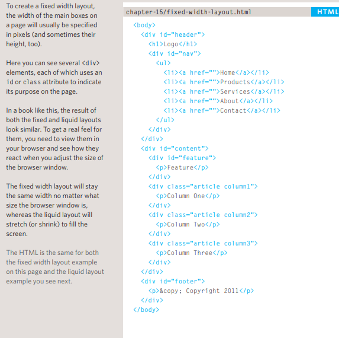

# Read 08
# Controlling the Position of Elements

## Normal flow
Every block-level element
appears on a new line, causing
each item to appear lower down
the page than the previous one.
Even if you specify the width
of the boxes and there is space
for two elements to sit side-byside, they will not appear next
to each other. This is the default
behavior (unless you tell the
browser to do something else).

## Relative Positioning
This moves an element from the
position it would be in normal
flow, shifting it to the top, right,
bottom, or left of where it
would have been placed. This
does not affect the position of
surrounding elements; they stay
in the position they would be in
in normal flow.

## Absolute positioning
This positions the element
in relation to its containing
element. It is taken out of
normal flow, meaning that it
does not affect the position
of any surrounding elements
(as they simply ignore the
space it would have taken up).
Absolutely positioned elements
move as users scroll up and
down the page.

<pre>

HTML

< body>
< h1>The Evolution of the Bicycle< /h1>
< p>In 1817 Baron von Drais invented a walking
 machine that would help him get around the
 royal gardens faster...< /p>
< /body>

CSS
p.example {
position: relative;
top: 10px;
left: 100px;} 
</pre>
_____________________

# A Fixed Width Layout

 
   
   # A Liquid Layout

