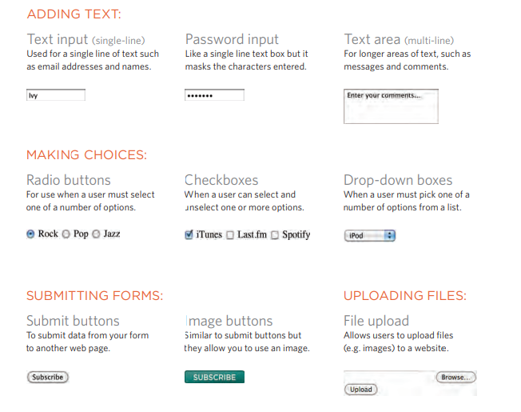
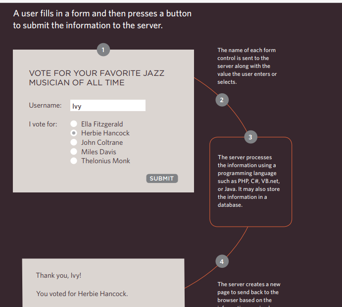
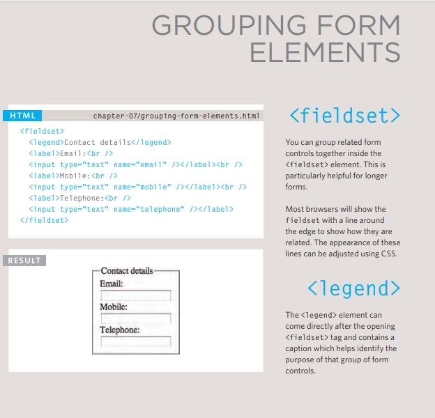
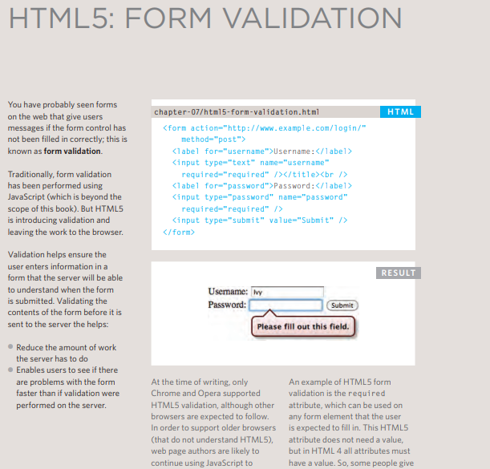

# FORM

# There are several types of Forms 

# How Do They Work 

# What We Use To Collect Data From Users ?

# Text Input 
# Text Area
# Radio Buttons
# Checkbox
# Password Input
# Drop Down List Box
# Multiple Select Box
# File Input Box
# Submit Button
# Image Button

# Groupping Forms Elements 

# Form Validation
