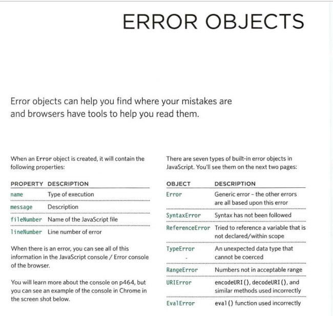
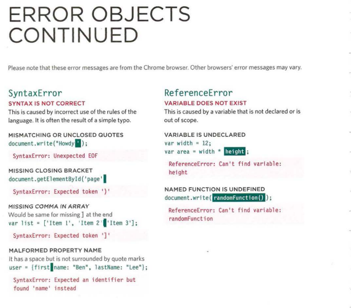
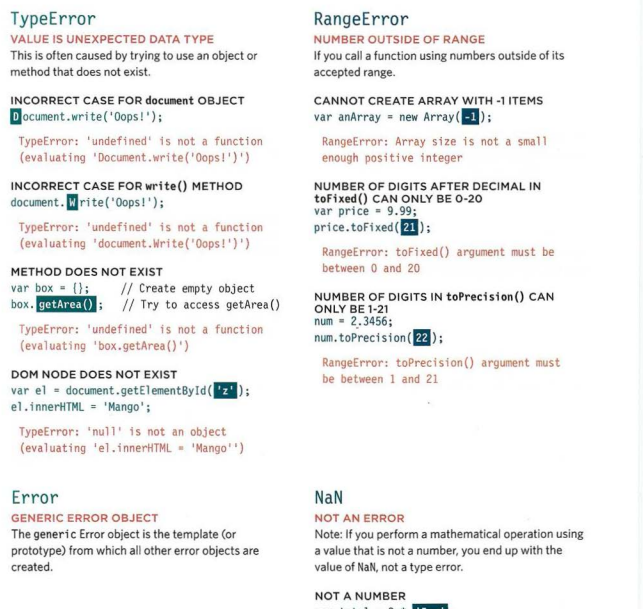

# Error Handling & Debugging 

ORDER OF EXECUTION
To find the source of an error, it helps to know how scripts are processed.
The order in which statements are executed can be complex; some tasks
cannot complete until another statement or function has been run.

 

 

 
 

## Ev alError
INCORRECT USE OF eval() 

FUNCTION
The eva l () function evaluates text through the
interpreter and runs it as code (it is not discussed
in this book). It is rare that you would see this type
of error, as browsers often throw other errors when
they are supposed to throw an Eva 1 Error.
8 ERROR HANDLING & DEBUGGING
Ref erenceError
VARIABLE DOES NOT EXIST
This is caused by a variable that is not declared or is
out of scope.
VA RIABLE IS UNDECLARED
var wi dth = 12 ;
var area = width * llt!ftNU! ;
ReferenceError: Can ' t find vari able:
height
NAMED FUNCTION IS UNDEFINED
document.write ( randomFunction() ) ;
ReferenceError: Can't find variable :
randomFunction

## UR I Error

INCORRECT USE OF URI FUNCTIONS

If these characters are not escaped in URls, they will
cause an error: / ? & I : ;
CHARACTERS ARE NOT ESCAPED
decodeURI('http: //bbc . com/ news . phplla=l');
URlError: URI error

 

 

## Error

GENERIC ERROR OBJECT

The generic Error object is the template (or
prototype) from which all other error objects are
created.
RangeError
NUMBER OUTSIDE OF RANGE
If you call a function using numbers outside of its
accepted range.
CANNOT CREATE ARRAY WITH -1 ITEMS
var anArray = new rray( );
RangeError: Array si ze is not a smal l
enough positive integer
NUMBER OF DIGITS AFTER DECIMAL IN
tofhed() CAN ONLY BE 0-20
var price = 9.99;
price.toFixed(fJI);
RangeError: toFixed() argument must be
between 0 and 20
NUMBER OF DIGITS IN toPrecision() CAN
ONLY BE 1-21
num = 2.3456;
num.toPrecision(flJ);
RangeError: toPrecision() argument must
be between 1 and 21

## NaN

NOT AN ERROR

Note: If you perform a mathematical operation using
a value that is not a number, you end up with the
value of NaN, not a type error.
NOT A NUMBER
var total = 3 * lilllJil;

## SUMMARY 
* If you understand execution contexts (which have two
stages) and stacks, you are more likely to find the error
in your code.

* Debugging is the process of finding errors. It involves a
process of deduction.

* The console helps narrow down the area in which the
error is located, so you can try to find the exact error.

* JavaScript has 7 different types of errors. Each creates
its own error object, which can tell you its line number
and gives a description of the error.

* If you know that you may get an error, you can handle
it gracefully using the try, catch, finally statements.
Use them to give your users helpful feedback.

