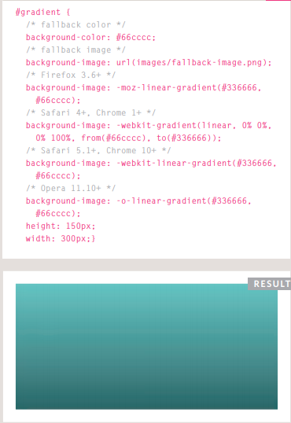
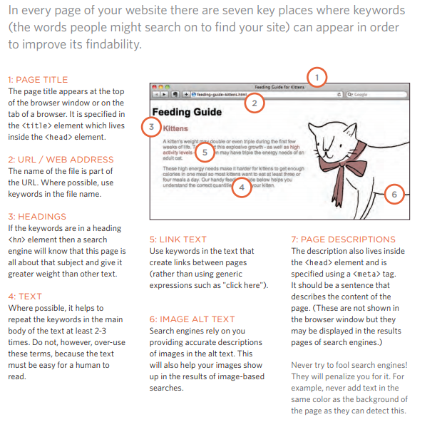
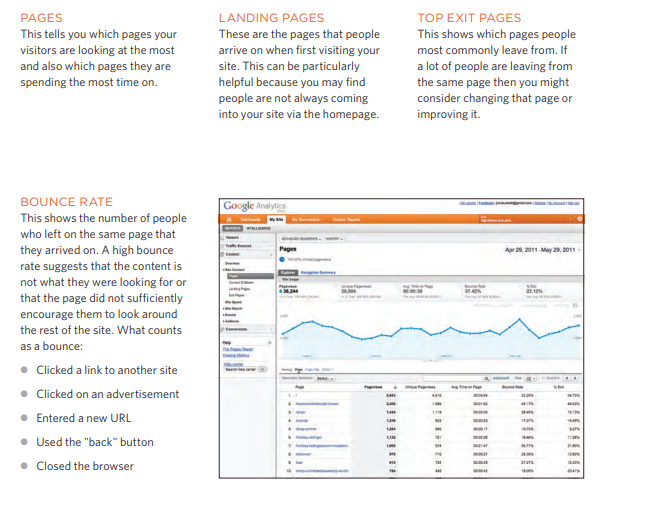

# Controlling Images Sizing in CSS 

You can control the size of an
image using the width and
height properties in CSS, just
like you can for any other box.

<pre>
img{
    width:...;
    height:....;
}
</pre>

_______________

 

# Aligning images in CSS

Using float property 
 

<pre>
img.align-left {
float: left; ---> put image in the left side
margin-right: 10px;}
img.align-right {
float: right; --> put image in right side
margin-left: 10px;}
img.medium {
width: 250px;
height: 250px;}
</pre>

# Centering images Using CSS

## 1: On the containing element
you can use the text-align
property with a value of center.

## 2: On the image itself
 you can use the use the margin property
and set the values of the left and
right margins to auto.
 
<pre>
img.align-center {
display: block;
margin: 0px auto;}
img.medium {
width: 250px;
height: 250px;}
</pre>

___________________________

# Background Images

The background-image
property allows you to place
an image behind any HTML
element.

<pre>
body {
background-image: url("images/pattern.gif");}
</pre>

<pre>
p {
background-image: url("images/pattern.gif");}
</pre>

______________________

# Repeating Images
 * ## background-repeat
* ## background-attachment
## Values Of Background-repeat
## repeat-x
The image is repeated
horizontally only (as shown in
the first example on the left).

## repeat-y
The image is repeated vertically
only.

## no-repeat
The image is only shown once

<pre>
body {
background-image: url("images/tulip.gif");
background-repeat: no-repeat;
background-attachment: fixed;}
</pre>

 
 

## Values Of Background-attachment

## fixed
The background image stays in
the same position on the page.

## scroll
The background image moves
up and down as the user scrolls
up and down the page

______________
  

# background-position

## background-position

## Values
 * left top
 * left center
 * left bottom
 * center top
 * center center
 * center bottom
 * right top
 * right center
 * right bottom

 _______________

  
 
 

 # Background-Gradient

 The
gradient is created using the
background-image property
and, at the time of writing,
different browsers required a
different syntax.

________________________________________

# Search Engine 
Optimization (SEO)

SEO is a huge topic and several books have been written on the subject.
The following pages will help you understand the key concepts so you can
improve your website's visibility on search engines.

 
 # On Page SEO
 

 # How Many People Are Coming to Your Site?
 

 # What Are Your Visitors Looking At?

 

 # Domain Names & Hosting
 

 

 ## X Search engine optimization helps visitors find your sites when using search engines.
## X Analytics tools such as Google Analytics allow you to see how many people visit your site, how they find it, and what they do when they get there.
## X To put your site on the web, you will need to obtain a domain name and web hosting.
## X FTP programs allow you to transfer files from your local computer to your web server.
## X Many companies provide platforms for blogging, email newsletters, e-commerce and other popular website tools (to save you writing them from scratch)